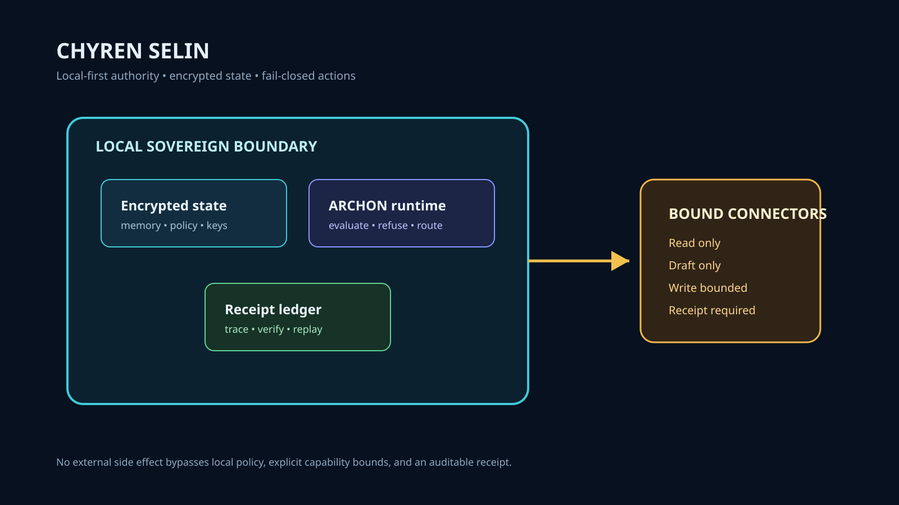

# Chyren SELIN

Sovereign AI Governance Node & ARCHON Runtime — Local-first, encrypted, fail-closed mathematical verification.



## System Role & Mission

`chyren-selin` is the open, distributable incarnation of the Chyren sovereign intelligence stack. Where `chyren-aeon` is the private unified core, SELIN is designed for self-hosted sovereign deployment: running local-first on user hardware with zero telemetry, encrypted-at-rest state, and fail-closed capability gates.

## Core Architectural Invariants

- **Local Sovereign Boundary**: All personal memory, cryptographic keys, and raw conversation history reside exclusively on local SQLite/encrypted storage.
- **Fail-Closed Execution**: If an external connector, model, or policy evaluator is unreachable or degraded, SELIN fails closed: actions are refused rather than executed without oversight.
- **Strict Connector Capabilities**: External tools operate under fixed capability envelopes (`read_only`, `draft_only`, `write_bounded`). External writes always require local policy approval and an immutable receipt.

## Architecture

```
Operator Intent ──► ARCHON Runtime ──► Local Policy Evaluator ──► Bounded Connector ──► Action Receipt
                          │                       │
                          ▼                       ▼
                   Encrypted State        Local Receipt Ledger
                   (SQLite / SQLCipher)    (Replay & Audit)
```

## Toolchain & Services

- **Rust Core**: Native ARCHON kernel and cryptographic primitives in `archon_kernel/` (`Cargo.toml`).
- **Node / Runtime CLI**: Local orchestration bridge and CLI tooling (`package.json`).
- **Self-Hosting**: Deployable via root `Dockerfile` and `docker-compose.yml`.

## Verification & Local Run

```bash
# Verify Rust ARCHON kernel
cargo test --locked

# Verify local Node services
npm test
```
