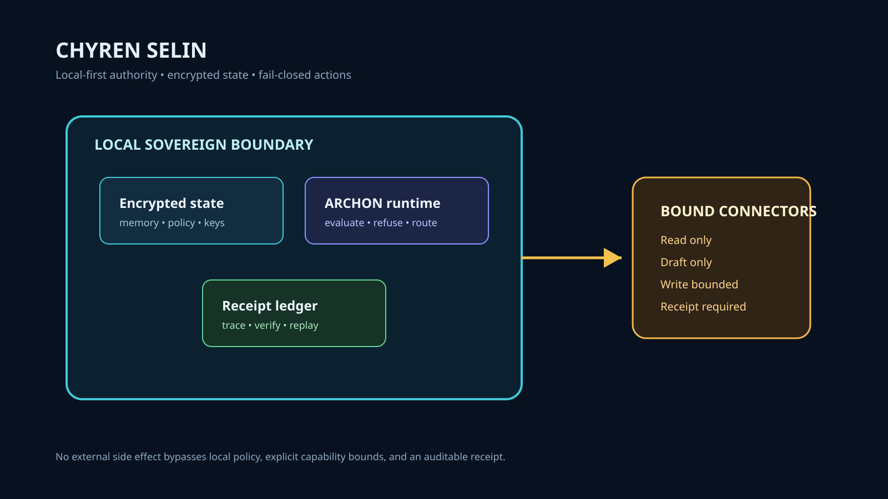

# Chyren SELIN

<p align="left">
  <a href="https://huggingface.co/datasets/ChyRho/chyren-selin"></a>
  <a href="https://orcid.org/0009-0001-1303-7190"></a>
  <a href="https://resnova-hub-f4ucvy3e.manus.space"></a>
  <a href="https://www.linkedin.com/in/r-w-yett/"></a>
  <a href="https://x.com/_chyrho_"></a>
</p>

Local-first AI governance node and ARCHON runtime. Encrypted, fail-closed mathematical verification.



## System Role & Mission

`chyren-selin` is the open, distributable build of the Chyren stack. `chyren-aeon` is the private core. SELIN is meant to run on the user's own hardware: local-first, no telemetry, encrypted state, and fail-closed capability gates.

## Core Architectural Invariants

- **Local boundary**: All personal memory, cryptographic keys, and raw conversation history reside exclusively on local SQLite/encrypted storage.
- **Fail-Closed Execution**: If an external connector, model, or policy evaluator is unreachable or degraded, SELIN fails closed: actions are refused rather than executed without oversight.
- **Strict Connector Capabilities**: External tools operate under fixed capability envelopes (`read_only`, `draft_only`, `write_bounded`). External writes always require local policy approval and an immutable receipt.

## Architecture

```
Operator Intent ──► ARCHON Runtime ──► Local Policy Evaluator ──► Bounded Connector ──► Action Receipt
                          │                       │
                          ▼                       ▼
                   Encrypted State        Local Receipt Ledger
                   (SQLite / SQLCipher)    (Replay & Audit)
```

## Toolchain & Services

- **Rust Core**: Native ARCHON kernel and cryptographic primitives in `archon_kernel/` (`Cargo.toml`).
- **Node / Runtime CLI**: Local orchestration bridge and CLI tooling (`package.json`).
- **Self-Hosting**: Deployable via root `Dockerfile` and `docker-compose.yml`.

## Verification & Local Run

```bash
# Verify Rust ARCHON kernel
cargo test --locked

# Verify local Node services
npm test
```

## How this was built

R.W. Yett directs the work. Much of the code and prose was written with AI coding assistants; those commits carry `Co-Authored-By` trailers. What holds is what `cargo test` and `npm test` check.
